# E-Commerce Review Intelligence

An end-to-end machine learning system that analyzes e-commerce reviews with two complementary AI engines:

- **Semantic Sentiment Analyzer** (NLP classification)
- **Review Helpfulness Predictor** (regression with cold-start fallback routing)

This project combines large-scale data processing, feature engineering, model benchmarking, ensembling, and deployment through a Streamlit web app.

---

## Project Team

| Name | GitHub |
|---|---|
| Nevil Vataliya | [NevilVataliya](https://github.com/NevilVataliya) |
| Prankit Vishwakarma| [prank-vish](https://github.com/prank-vish) |
| Parth Modi | [parthm2005](https://github.com/parthm2005) |

---

## 1. Project Overview

Online reviews contain two high-value signals:

1. **What is the emotional tone of the review text?**
2. **How helpful is the review likely to be for other shoppers?**

This project addresses both with a **dual-pipeline architecture**:

- **Pipeline A (Sentiment):** classifies review text into Negative, Neutral, Positive.
- **Pipeline B (Helpfulness):** predicts normalized helpfulness (`vote_rate`) and handles missing metadata using fallback models.

The full workflow is built around the Amazon Electronics review data (`Electronics.json`) and engineered for high-volume processing.

### 1.1 Business Problems Solved

Problem 1: Review relevance and ranking
- Not all reviews are equally useful.
- Helpful reviews can be buried under low-quality reviews.
- Goal: predict helpfulness at posting time for dynamic sorting.

Problem 2: Sentiment understanding at scale
- Review text is unstructured and hard to interpret manually.
- Brands need precise signals of what customers like/dislike.
- Goal: classify semantic tone as Positive, Neutral, or Negative.

### 1.2 Scale Snapshot

- Raw source: 12GB+ Amazon Electronics JSON dataset
- Memory-safe chunking: 1,000,000 rows per chunk
- Processed and sampled output for modeling: 2.6M+ rows

---

## 2. Core Highlights

- Memory-efficient chunk processing for large JSON files
- Stratified sampling and data quality filtering
- Rich feature engineering (text, metadata, user reputation, item reputation)
- Multi-model evaluation (Decision Tree, Random Forest, LightGBM, XGBoost, Ridge)
- Soft-voting ensembles and blend-weight search
- Cold-start fallback architecture for real-world missing data cases
- Streamlit deployment with route-aware prediction logic

---

## 3. Repository Structure

```text
DSLab_Project_ECommerceReviewIntelligence_U23CS158/
├── README.md
├── screenshots/
│   ├── image.png
│   ├── output.png
│   └── eda_plot_01.png ... eda_plot_22.png
└── source_code/
    ├── app.py
    ├── sentiment_analysis.ipynb
    └── voting_prediction.ipynb
```

---

## 4. System Architecture

```text
                         +------------------------------+
                         |      Electronics.json        |
                         +--------------+---------------+
                                        |
               +------------------------+-------------------------+
               |                                                  |
     +---------v---------+                              +---------v----------+
     | Sentiment Pipeline|                              | Helpfulness Pipeline|
     +-------------------+                              +---------------------+
     | VADER + conflict  |                              | Metadata features   |
     | handling w/ BERT  |                              | + vote_rate target  |
     | TF-IDF (1,2)-gram |                              | Model tuning/blends |
     | LGBM/RF/Ensemble  |                              | Fallback models     |
     +---------+---------+                              +----------+----------+
               |                                                   |
               +-----------------------+---------------------------+
                                       |
                            +----------v-----------+
                            |   Streamlit app      |
                            | app.py (2 AI modes)  |
                            +----------------------+
```

---

## 5. Pipeline A: Sentiment Analysis

Notebook: `source_code/sentiment_analysis.ipynb`

### 5.1 Data Processing

- Reads review data in chunks
- Filters verified reviews
- Computes VADER compound sentiment scores
- Cleans and merges review text/summary where useful
- Detects rating-sentiment conflicts and reclassifies conflict cases with DistilBERT

### 5.2 Labeling and Filtering Strategy

- Initial tone thresholds:
	- Positive if score > 0.1
	- Negative if score < -0.1
	- Neutral otherwise
- Conflict detection between star rating and sentiment score
- Advanced filtering:
	- review length bounds
	- confidence filtering on BERT-rerouted subset
	- consistency constraints for Neutral labels
- Class balancing before final training
- DistilBERT conflict-audit stage (presentation result): reduced false 1-star positive conflicts from about 63k to about 11k

### 5.3 Vectorization and Models

- `TfidfVectorizer(max_features=10000, ngram_range=(1,2), sublinear_tf=True)`
- Evaluated models:
	- Decision Tree
	- Random Forest
	- LightGBM
	- Soft-voting Ensemble (LightGBM + Random Forest)

### 5.4 Sentiment Results (Notebook Outputs)

- Conflict ratio: **7.74%**
- Balanced training subset (advanced filtering stage): **62,319 rows**

Model accuracy snapshot:

| Model | Accuracy |
|---|---:|
| Decision Tree | 0.6591 |
| Random Forest | 0.7080 |
| LightGBM | **0.7827** |
| LGBM + RF Ensemble | 0.7788 |

Saved artifacts from this pipeline:

- `sentiment_lgb_model.joblib`
- `tfidf_vectorizer.joblib`
- (optional experimental) `sentiment_ensemble_model.joblib`

---

## 6. Pipeline B: Helpfulness Prediction

Notebook: `source_code/voting_prediction.ipynb`

### 6.1 Large-Scale Sampling

- Chunk-wise ingestion (`chunksize=1,000,000`)
- Verified reviews only
- Target cleanup: `vote` converted to numeric
- Stratified handling:
	- helpful (`vote >= 2`) retained
	- unhelpful (`vote < 2`) downsampled (`frac=0.05`)
- Initial sampled dataset output: **2,656,789 rows**
- Severe sparsity addressed: about 76% of reviews have zero votes, so aggressive class-aware downsampling was used to reduce the accuracy paradox

### 6.2 Feature Engineering

Key engineered features include:

- `image_count`
- `review_age_days`
- `vote_rate` (target normalization)
- `word_count`, `paragraph_count`, `words_per_paragraph`, `caps_count`
- `user_avg_helpful_votes`
- `item_avg_helpful_votes`
- `item_avg_rating`
- `rating_deviation`
- `sentiment_score` (VADER)

### 6.3 Baseline Regression Comparison

| Model | MAE | RMSE | R-Squared |
|---|---:|---:|---:|
| Ridge Regression (Linear) | 0.0958 | 0.4246 | 0.4139 |
| Random Forest (Bagging) | 0.0877 | 0.4174 | **0.4336** |
| XGBoost (Boosting) | 0.0890 | 0.4644 | 0.2988 |
| LightGBM (Boosting) | 0.0876 | 0.4224 | 0.4200 |

### 6.4 Tuned Model Snapshot (RandomizedSearchCV)

| Model | MAE | RMSE | R-Squared |
|---|---:|---:|---:|
| RandomForest | 0.0866 | 0.4159 | **0.4376** |
| LightGBM | 0.0916 | 0.4169 | 0.4349 |
| Ridge | 0.0958 | 0.4246 | 0.4139 |
| XGBoost | 0.0903 | 0.4505 | 0.3401 |

### 6.5 Algorithm-Specific Feature-Diet Pipeline

Custom feature-set leaderboard:

| Model | Feature Count | MAE | RMSE | R-Squared |
|---|---:|---:|---:|---:|
| LightGBM (Tuned - 8 Features) | 8 | 0.0916 | 0.4161 | **0.4370** |
| Random Forest (Kitchen Sink - 10 Features) | 10 | 0.0877 | 0.4179 | 0.4322 |
| Ridge (Strict Independent - 5 Features) | 5 | 0.0953 | 0.4248 | 0.4134 |
| XGBoost (Tuned - 8 Features) | 8 | 0.0902 | 0.4500 | 0.3417 |

### 6.6 Ensemble Blending

- Equal blend (LGBM + RF):
	- MAE: **0.0893**
	- RMSE: **0.4141**
	- R-Squared: **0.4425**
- Tuned blend ratio search:
	- Optimal ratio: **57% LightGBM / 43% Random Forest**
	- MAE: **0.0896**
	- RMSE: **0.4141**
	- R-Squared: **0.4426**

### 6.7 Fallback Architecture (Cold-Start Handling)

The project also trains fallback models for edge cases:

- New user (no user history)
- New product (no item history)
- New user + new product (pure content path)

Notebook sanity-check outputs for fallback paths include:

- `Lab R-Squared: 0.0574`
- `Lab R-Squared: 0.3737`
- `Lab R-Squared: 0.0372`

### 6.8 Production Stress Test Outputs

On 1% random slices of the full source data, notebook outputs report:

- Variant A: MAE 0.0215, RMSE 0.1263, R-Squared 0.5995
- Variant B: MAE 0.0203, RMSE 0.1257, R-Squared 0.6030

Saved artifact from this pipeline:

- `ecommerce_ensemble_model.joblib`

---

## 7. Streamlit Application

File: `source_code/app.py`

Live deployment:
- https://ecom-review-intelligence.streamlit.app

The app exposes two modes:

1. **Sentiment Analyzer (NLP)**
	 - Uses `sentiment_lgb_model.joblib` + `tfidf_vectorizer.joblib`
	 - Returns label + confidence

2. **Helpfulness Predictor**
	 - Uses `ecommerce_ensemble_model.joblib`
	 - Uses fallback routing artifact `ecommerce_fallbacks_ensembled.joblib`
	 - Dynamically routes request by metadata availability:
		 - complete data -> main 8-feature ensemble
		 - missing user -> product-biased fallback
		 - missing product -> user-biased fallback
		 - missing both -> pure-content fallback

---

## 8. Visual Outputs (Structured by Problem Statement)

### 8.1 PS2 - Sentiment Classifier (Pipeline A)

#### Sentiment Distribution and Rating Alignment

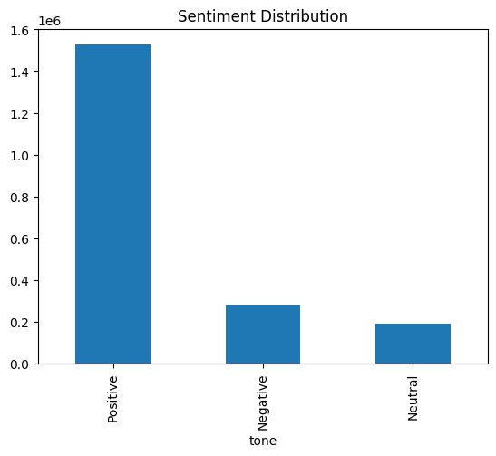
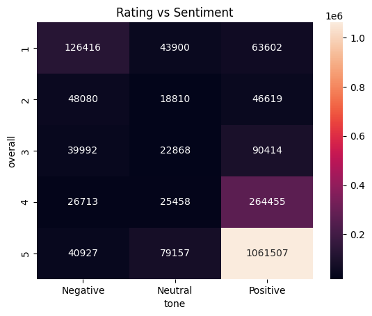
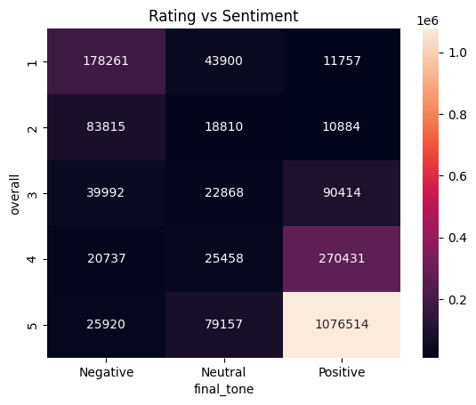

#### Sentiment Model Diagnostics

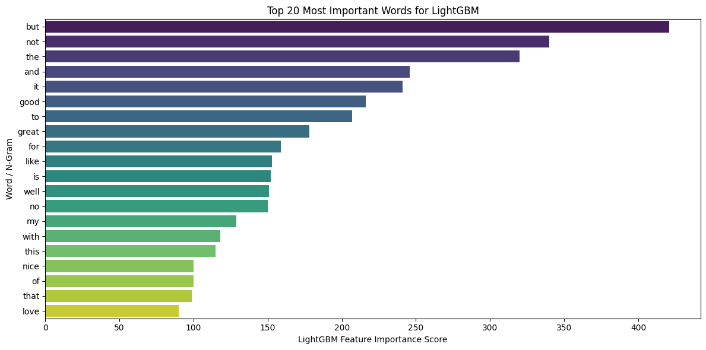
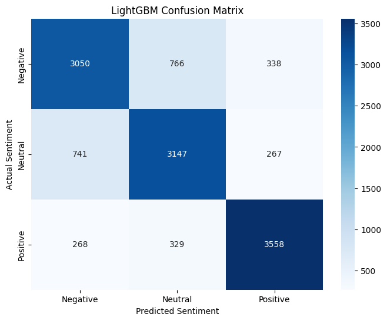
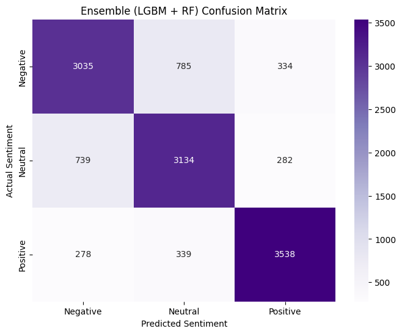
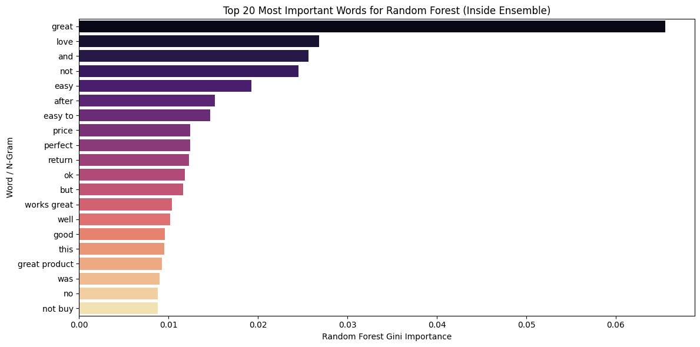

#### Additional Sentiment EDA

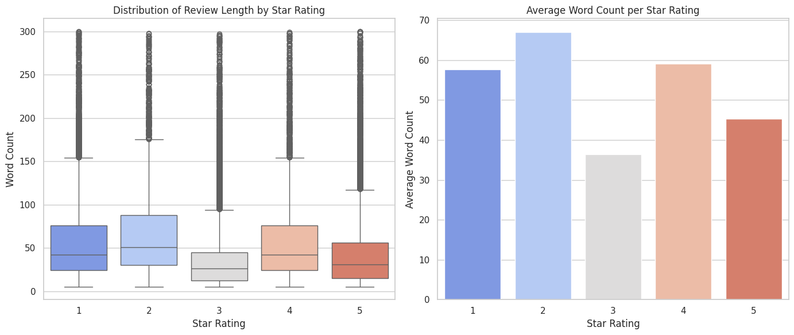
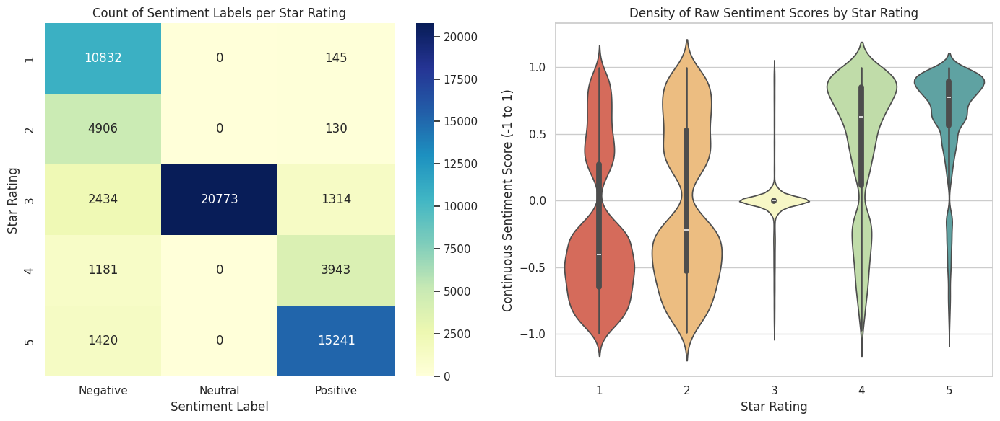
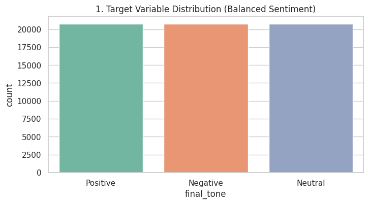
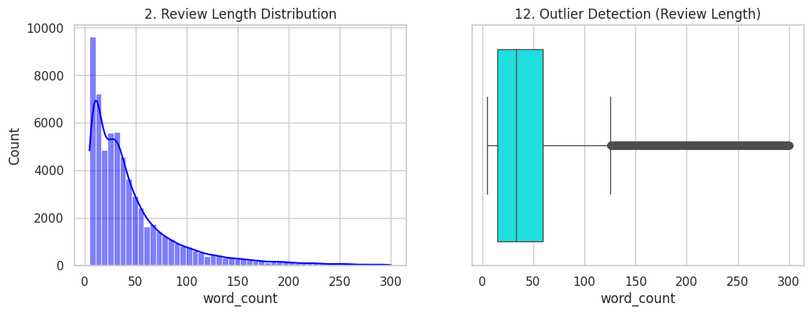
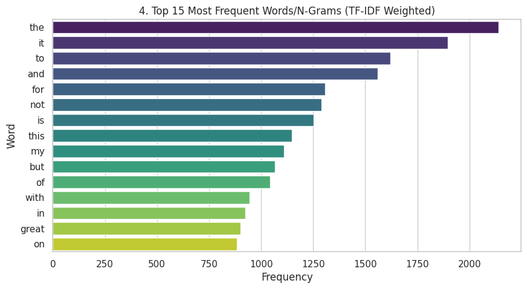
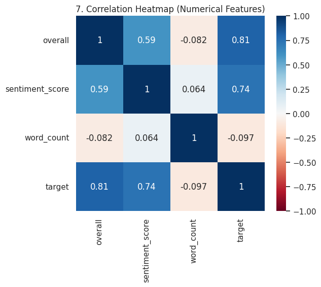
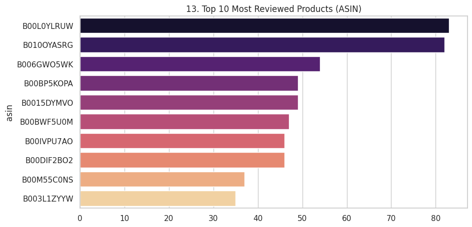

#### Length-Wise Accuracy Comparison

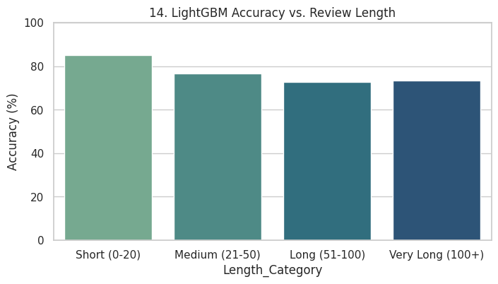
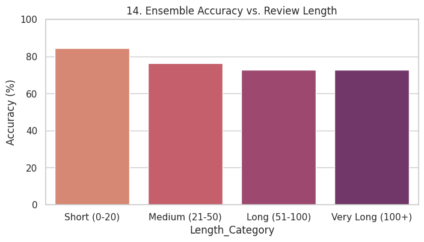

### 8.2 PS1 - Helpfulness Predictor (Pipeline B)

#### Helpfulness EDA and Feature Insights

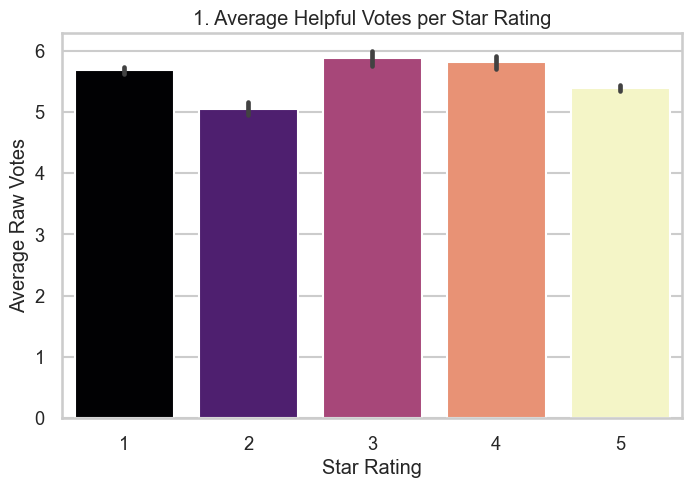
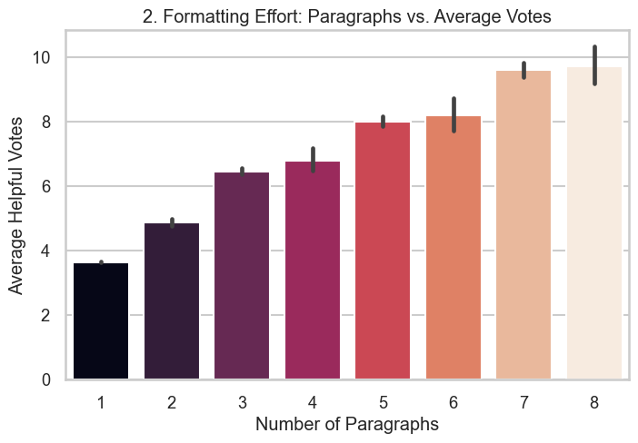
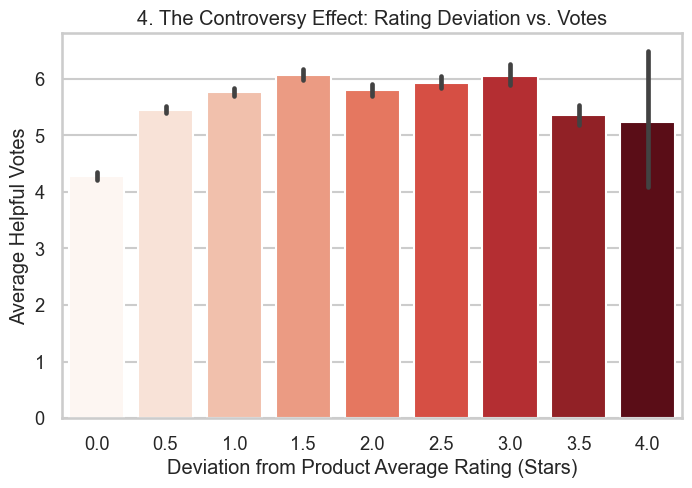
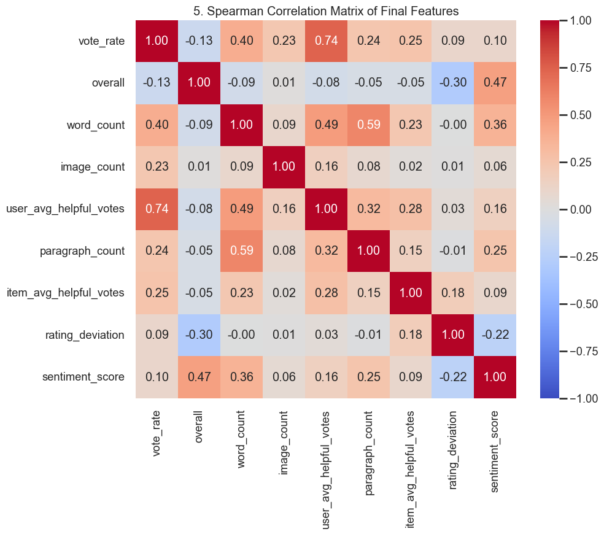
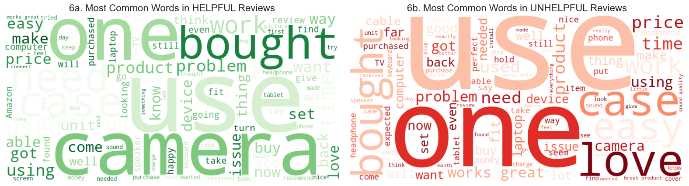
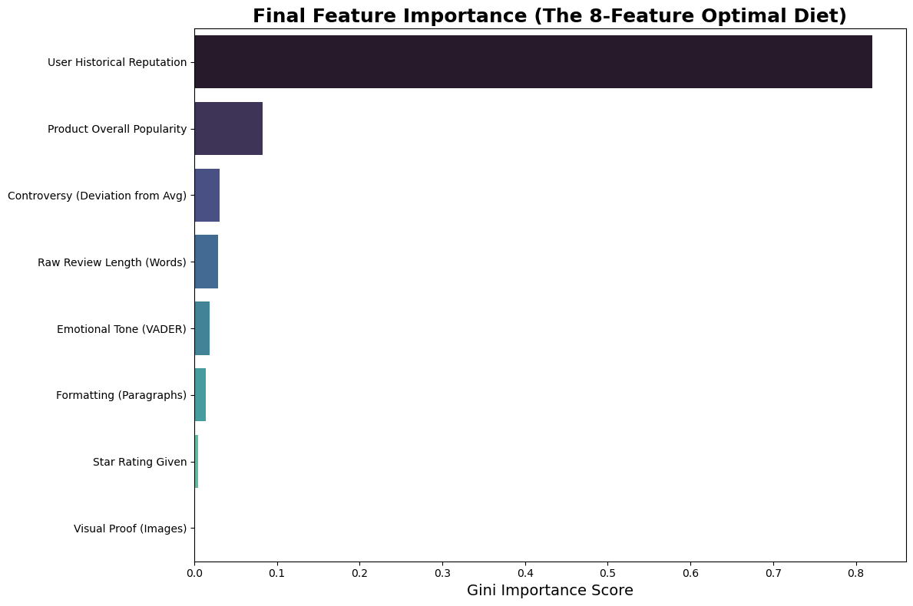

---

## 9. Setup and Reproduction

### 9.1 Recommended Environment

- Python 3.10+
- Jupyter Notebook / JupyterLab
- Streamlit

### 9.2 Install Dependencies

```bash
pip install numpy pandas scikit-learn lightgbm xgboost nltk vaderSentiment textblob transformers torch joblib matplotlib seaborn wordcloud streamlit
```

### 9.3 Reproduce Training Workflow

Run notebooks in this order:

1. `source_code/sentiment_analysis.ipynb`
2. `source_code/voting_prediction.ipynb`

Ensure the trained artifacts are available to `source_code/app.py`:

- `sentiment_lgb_model.joblib`
- `tfidf_vectorizer.joblib`
- `ecommerce_ensemble_model.joblib`
- `ecommerce_fallbacks_ensembled.joblib`

### 9.4 Launch the Web App

```bash
cd source_code
streamlit run app.py
```

---

## 10. Notes and Scope

- Metrics above are taken from saved notebook outputs in this project and may vary with reruns, sampling, or environment changes.
- Some cells represent iterative experimentation (multiple model variants and duplicate stress-test blocks).
- The Streamlit app expects serialized model artifacts in a specific format; keep artifact keys consistent when retraining.

---

## 11. Project Value

This project demonstrates practical ML engineering for review intelligence at scale:

- robust preprocessing for large real-world data
- explainable visual diagnostics
- empirical model comparison and tuning
- deployment-aware design (cold-start routing and user-facing app)

---

## 12. Comparison with Existing Work

Reference paper:
- **Were You Helpful - Predicting Helpful Votes from Amazon Reviews**

Reference direction:
- Focused on helpfulness prediction only
- Primarily metadata-driven modeling

Our project direction:
- Unified dual-pipeline system covering both helpfulness and sentiment
- Combines metadata with NLP/text-derived signals
- Deploys real-time routing for cold-start scenarios
- Produces both business outputs: vote-rate prediction and semantic sentiment classification

---

## 13. Challenges, Limitations, and Future Work

### 13.1 Key Challenges

- Sarcasm and implicit sentiment in review text
- Ambiguous language and mixed polarity statements
- Extreme class sparsity in helpfulness targets
- Large-volume ingestion and feature generation cost

### 13.2 Current Limitations

- Sentiment labels partially depend on rating-linked heuristics and can carry noise
- Helpfulness ceiling in lab metrics suggests missing behavioral signals (for example, impressions/click-through/session data)
- Fallback ablation indicates platform bias toward high-reputation users and weaker pure-text-only helpfulness prediction

### 13.3 Future Improvements

- Replace TF-IDF + VADER components with stronger LLM or transformer-based semantic modeling
- Add explicit review-quality scoring and learning-to-rank objectives
- Introduce richer online signals where available to improve ranking fidelity
- Improve sarcasm-aware sentiment handling with context-sensitive encoders

---

## 14. Conclusion and Demo

This project converts large, raw e-commerce review streams into a practical decision engine for:

- **Customer insight** via semantic sentiment classification
- **Predictive sorting** via helpfulness estimation at post time

The Streamlit application demonstrates both pipelines interactively on live inputs, including dynamic fallback routing for cold-start cases.

Live demo URL:
- https://ecom-review-intelligence.streamlit.app

